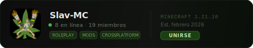

# 🕷️ Segestria Launcher

> Launcher custom para Minecraft no-premium. Hecho para vicios con amigos. Mods, updates automáticas, y que funcione en PC y móvil.

---

## Stack Tecnológico

Rust se encarga de toda la lógica pesada del launcher. Kotlin maneja la UI y la lógica específica de Android. En escritorio corre mediante Rust + Tauri en Windows, Linux y macOS. En móvil, Android con Kotlin + Jetpack Compose.

---

## Organización del Proyecto

El proyecto se divide en tres grandes bloques.

**Core (Rust)** — Es el cerebro del launcher. Todo lo que hace el launcher está aquí: descargar archivos, verificar versiones, manejar mods, y lanzar Minecraft. Este código es el mismo para PC y Android. No sabe ni le importa si lo llaman desde una ventana en Windows o desde un botón en un teléfono. Solo hace su trabajo.

**PC (Rust + Tauri)** — La versión de escritorio. Tauri se encarga de crear la ventana y la interfaz, pero cuando hay que hacer algo importante llama al Core. La interfaz es lo mínimo necesario: un botón grande, un selector de versiones, una barra de progreso. Nada más.

**Android (Kotlin)** — La versión para móvil. La interfaz está hecha con Jetpack Compose. Cuando el usuario toca un botón, Kotlin llama a funciones del Core compiladas para Android. El Core vive dentro de la app como una librería nativa. El usuario no nota nada raro, todo se ve y se siente como una app normal.

---

## Backend

Los archivos viven en la nube. La verificación de quién puede jugar la hace Discord.

Los mods, configuraciones y jars están guardados en almacenamiento cloud con distribución global. Hay un manifest que siempre apunta a la versión más reciente: qué mods van, en qué versión, y con qué checksums para verificar que estén íntegros. El launcher lee ese archivo, compara con lo que tiene instalado, y baja solo lo que falta o cambió.

Para entrar, el usuario inicia sesión con su cuenta de Discord. Si está en el servidor, puede jugar. Si no, no. Así controlamos quién tiene acceso sin manejar contraseñas ni cuentas propias. Cambiar de versión es actualizar el manifest y subir los archivos nuevos. El launcher se entera solo la próxima vez que alguien lo abra. Los archivos se sirven desde el datacenter más cercano al usuario, no importa dónde esté.

---

## Qué hace cada parte

**Core (Rust)** — Maneja el login con Discord y guarda el token de forma segura. Sabe qué versión está instalada localmente y la compara contra la última disponible. Descarga archivos y verifica que estén completos e íntegros. Maneja la lista de mods y sus dependencias. Prepara los argumentos correctos para lanzar Minecraft y limpia versiones viejas si hace falta.

**PC (Tauri)** — Muestra una pantalla de login con Discord la primera vez. Después, una ventana con botón de jugar y selector de versiones. Cuando apretás jugar, le pide al Core que haga su trabajo y muestra una barra de progreso mientras descarga cosas. Si algo falla, muestra el error claro. Cuando el Core termina, cierra la ventana y se abre Minecraft.

**Android (Kotlin)** — Misma idea pero adaptada a pantalla táctil. El login con Discord abre el navegador y vuelve a la app cuando termina. Los botones son más grandes, la interfaz se ve bien en móvil. Cuando tocás jugar, llama a las mismas funciones del Core compiladas para Android. El Minecraft de Android se lanza con los mismos mods que en PC.

---

## Flujo de actualizaciones

El usuario abre el launcher. Si es la primera vez, pasa por el login de Discord. Después, el launcher mira su versión local y la compara con el manifest. Si hay diferencia, descarga la lista de mods de la nueva versión, compara lo que ya tiene contra lo que necesita, y baja solo lo que falta o cambió. Cuando todo está en orden, lanza Minecraft. Si hay un error en cualquier punto, avisa con claridad y no lanza nada.

---

## Por qué funciona así

Rust hace el trabajo pesado rápido y seguro. Maneja archivos, conexiones y procesos sin colgarse ni consumir recursos de más. Kotlin hace que se vea bien en Android, aprovechando todo lo que Google ya construyó. Tauri hace que en PC sea liviano — nada de Electron con 300MB de RAM. La nube distribuye los archivos globalmente sin que tengamos que administrar servidores. Discord hace de sistema de autenticación sin que tengamos que construir uno: ya tenemos el servidor, ya están todos ahí.

El launcher no toca cuentas premium ni nada raro. Solo verifica que el usuario esté en el servidor, baja los archivos correctos, y ejecuta Minecraft con los mods que tocan. Si algo falla, el Core en Rust es claro y dice qué pasó.

---

## El nombre

Segestria es una araña que espera escondida hasta que llega el momento. El launcher espera en segundo plano, y cuando toca actualizar o jugar, aparece y hace su trabajo rápido. Además suena mejor que "MinecraftLauncherFinalV3ConMods".

---

## Servidor de Discord

Ahí está el canal `#anuncios` con las versiones, `#mods` para pedir que agreguen cosas, y `#reportes` si algo explota.
